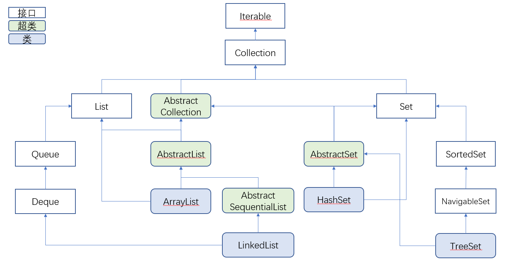
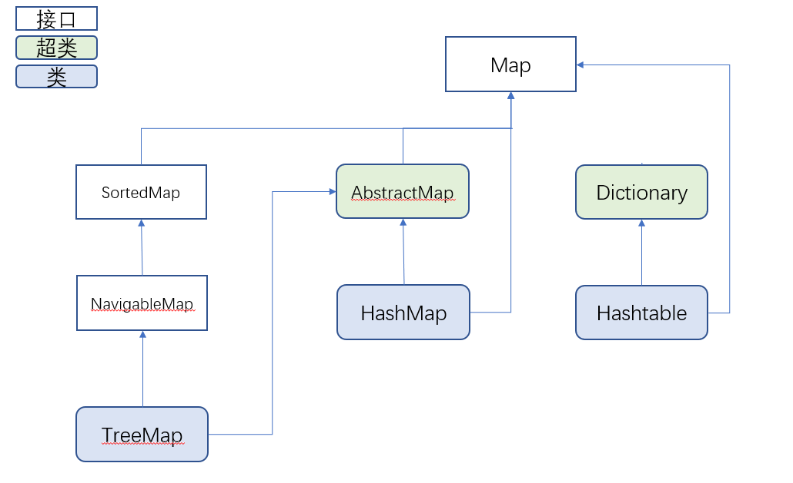
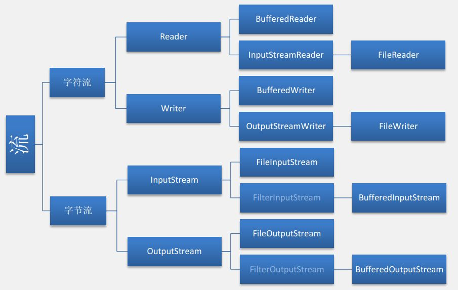

# Java快速入门（从C++到Java）

***
## Java和C++的异同
* Java的流程控制语句和C++一模一样
* Java的基本数据类型除了C++中的几个，还有byte，布尔类型是boolean.
* Java中表示空的关键字是`null`
* Java中所有变量，如果你使用了它但是没有给他赋初值的话，编译器会报错。也就是说java保证变量在使用之前一定初始化了。（你可以初始化为null来表示没有值）
* Java中所有可能抛出异常的操作你必须使用try,catch块将其包裹。但是C++不强制这样做。
* Java中的字符串是不能改变的，尽管这样做没有报错，但是字符串其实没有被改变：
    ```java
    String str = "123";
    str[2] = 'a';

    //str依然是"123"
    ```
* 基本数据类型不是类，但是Java为所有的基本数据类型创造了类(比如int-Integer)，这些类称为**闭包**。有时候函数让传递的是类而不是基本数据类型，要看清楚。
* ==符号比较的是对象的地址，`.equal()`函数比较的才是内容（重写了==或`.euqal()`的类除外）。
* Java的不定参数和C++一样，使用`int ... args`来声明。
* Java很啰嗦。

***
## Java的RTTI和反射
### RTTI

Java和C++11一样也有RTTI。如果你想获得Java类的信息，你可以有一下三种方法:
```java
//假设有Point类
Class c = Point.class;  //way1
Class c = Class.forName("Point");   //way2，参数为类名的字符串

//way3
Point p = new Point;
Class c = p.getClass();
```
**需要注意的是，way2是需要进行异常捕获的。因为可能不存在这个类**
这些函数都会返回`Class`类。`Class`类其实保存在.class文件中，也就是编译之后的.class文件。所以只有类才可以得到自己的Class对象，不是类或者不存在的类是没有办法得到的。需要注意的是，Array和Enum也被视为类。

通过Class对象，我们可以获得关于类的很多很多信息，比较有用的功能如下：
* 获得类的名称
    * getName()：获得类的名称
    * getSimpleName()：获得类的名称（不带包名）
* 判断类的类型
    * isLocalClass()：是不是局部类
    * isInterface()：是不是接口
    * isArray()：是数组吗
    * isEnum()：是枚举吗
    
    等其他很多很多的判断函数。
* 获得父类的Class对象：getSuperclass()
* 调用构造函数：newInstance()。但是这个函数只能调用默认构造函数。如果没有默认构造函数的话就报错。

总之有很多很多的函数可以帮助你查到类型的信息。

### 反射
反射是在RTTI的基础上，得到更多的类的信息，主要可以得到类的构造方法，成员函数，字段等等详细的信息。

要想使用反射，需要包含`java.lang.reflect.*`包。

反射的话可以通过下面这个例子看一下:
```java
//获得字段
Field[] fields = CPoint.getDeclaredFields();
for (Field f : fields)
    System.out.println(f);

//获得构造函数
Constructor[] construct = CPoint.getConstructors();
for (Constructor c : construct) {
    System.out.println(c);
}

//获得成员方法
Method[] methods = CPoint.getMethods();
for (Method m : methods) {
    System.out.println(m);
    System.out.println(m.getReturnType());
}
```

***
## Java容器
和C++一样，Java有着自己的容器。但是Java的容器稍显复杂，我们先来看一下继承树：



没错这里面其实能用的类没有几个，只有ArrayList（相当于C++中的vector），LinkedList（链表），HashSet（集合，不能存储重复的元素），TreeSet（红黑树）,HashMap（字典）, TreeMap（红黑树字典）, HashTable(哈希表)。
当然你可以通过向上转换的方式来实现其他的数据结构（或者容器），比如你可以这样写：

```java
Deque<Integer> deque = new LinkedList<Integer>();

Queue<Ineteger> queue = new LinkedList<Integer>();
```

这样你就可以使用队列和栈了。

所有的容器都是继承的Collection，它是所有容器的总接口。它又是继承的Iterable接口，Iterable接口让Collection有迭代功能。

### 容器差异
不同的容器使用方法不一样，比如ArrayList, HashSet和LinkedList使用`add()`方法加入数据，而HashMap则是`put()`方法。
其他差异见API文档咯。

### 容器的特性

* 所有的容器都自带有`toString`方法，你可以直接print它们。

* 所有的容器都是范型编程，你可以指定元素类型：
    ```java
    Collection<Integer> collection = new LinkedList<Integer>();
    ```
    或者不指定类型，这样的话类型默认为`Object`，你也可以理解为任意类型：
    ```java
    LinkedList ll = new LinkedList();
    ll.add((Float) 3.14f);
    ll.add((Integer) 5);
    ll.add((Boolean) false);
    ```

### 迭代器
和STL一样，每个容器都可以有迭代器：
```java
Iterator<Object> it = ll.iterator();
while (it.hasNext()) {
    System.out.println(it.toString());
    it.next();
}
```
容器通过`iterator()`方法返回其迭代器。

迭代器有如下常用的方法：

* hasNext()：用来判断是不是迭代到头了
* next()：跳到下一个元素（迭代器前进一步）
* remove()：删除当前元素
* toString()：输出数据的地址
* getClass()

注意迭代器不能输出当前元素，只能输出其地址（这一点和C++不一样）。

***
## Java目录操作
Java的目录操作很简单，只需要一个`File`类就可以了。
虽然叫做`File`，但是其实这个类并不是处理文件的，而是处理路径，文件夹的。也就是说他可以查看到文件的属性，但是不可以读写。

`File`类的构造函数中需要包含一个路径，可以是文件夹或者文件：
```java
File path = new File("./test/");
File path = new File("./test.txt");
```

你可以通过`exists()`来判断文件或者文件夹是否存在:
```java
if(path.exists())
```
如果不存在的话，可以创建:
```java
//is Directory:
path.mkdir();
path.mkdirs(); //if many directory in path

//is file:
path.createNewFile();
```
需要注意`createNewFile()`函数可能会抛出异常，需要try,catch。

如果是已经存在的文件或者文件夹，有一下常用方法：
* getName()：获得名称
* isDirectory()：判断是不是文件夹
* isFile()：判断是不是文件
* list()：如果是文件夹，会将文件夹下的所有文件和文件夹的名称作为String[]返回。
* canRead()/canWrite()：问价是否可读/可写
* length()：文件夹下文件/文件夹的个数
* getAbsolutePath()：获得绝对路径
* getPath()：获得路径，也就是你传入File构造函数的路径
* getParent()：获得当前文件/文件夹的父路径
* renameTo()：重命名
* delete()：删除

通过这些函数，我们可以写出一个递归遍历一个目录下的所有目录和文件的函数（见`DirOperator.java`中的`travleDir()`函数）

***
## Java输入输出操作
Java输入输出的类很多很多，首先还是来看一下继承图:



首先整个流分为字节流和字符流。所谓字符流，是读写都针对unicode编码的流。字节流就是针对字节读写的流了。这两种流都有对于文件和console的操作

首先我们来说字符流，字符流中对文件读写的一般都用`FileReader`和`FileWriter`。他们可以读写字符串。（例子请看IOOperator.java中的`readWriteFile()`函数）

针对console读写的类有`InputStreamReader`和`OutputStreamWriter`两个类。（具体例子见IOOperator.java的`readChar()`函数）

至于`BufferedReader`和`BufferedWriter`，顾名思义是带有缓冲的字节输入输出流。每次使用`read()`或者`write()`之后都必须使用`flush()`函数来强制将其输入到流中，方便大数据的一次性输入，节省时间。

当然，同理，字节流对文件的类是`FileOutputStream`和`FileInputStream`，以及缓冲的`BufferedInputStream`和`BufferedOutputStream`。它们的特点是只能对byte[]进行读写。一般可以用在二进制或者网络方面。

### 额外的类Scanner
Scanner是为控制台输入输出而定义的额外的类。因为`InputStreamReader`类每次只能读取一个char，所以我们有了Scanner类来对任意数据类型读取:
```java
Scanner scaner = new Scanner(System.in);
scaner.nextInt();       //读取int
scaner.next();          //读取String
scaner.nextBoolean();   //读取Boolean
```
scanner有一系列next方法可以针对不同的数据类型进行读取,很方便。

*** 
## Java的范型
Java的范型比C++要简单，不需要什么关键字修饰，你只需要在尖括号里面加上一个类型参数就可以了:
```java
//范型类
class tuple<A, B, C> {
    public tuple(A a, B b, C c) {
        this.a = a;
        this.b = b;
        this.c = c;
    }

    public String toString() {
        return a + "," + b + "," + c;
    }

    private A a;
    private B b;
    private C c;
}

//范型方法
public T sum<T>(T a, T b){
    return a+b;
}
```

### 范型的继承
范型可以被继承:
```java
public tuple<A,B,C>{/*many codes*/};

public pairs<A,B> extends tuple<A,B,C>{}//继承减少类型

public arrays<A,B,C,D> extends tuple<A,B,C>{} //继承增加类型
```

### 通配符?
？使用在声明范型类对象的时候。你可以使用通配符来表示接受任意的类型：
```java
LinkedList<?> ll;   //这里你不能实例化，因为没有确定类型。但是你可以让其指向一个已经实例化的子类。
```

你甚至可以这样写:
```java
LinkedList<? extends tuple> ll; //可以接受所有继承字tuple的类
LinkedList<? super arrays> la;  //可以接受所有为arrays的父类
```

***
## Java的注解
注解是Java比较特殊的一个地方。注解的用法是在函数或者字段上方写`@注解名称(注解参数1=值1， 注解参数2=值2， ...)`。一个注解只能管到其下方的一个函数:
```Java
@Override
public String toString(){
    //....
}
```
这里的`@Override`注解是没有注解参数的，所以就不用加上括号了。

### 系统注解
系统本身自带一些注解，比较常用的如下：
* `@Override`注解，这个注解会观察在其下方的函数是不是重载函数。如果在父类找不到相应的函数，会报错。
* `@Deprecated`注解，这个注解表示下面的方法或者字段是已经弃用的，编译的时候会有Warning
* `@SuppressWarnings`，关闭不当编译器警告信息。这个注解有很多参数，比如
    * `all`：抑制所有警告
    * `hiding`：抑制局部变量覆盖了全局变量而带来的警告
    * `unchecked`：抑制没有类型检查的警告

    和其他很多的警告都可以选择性抑制.

### 自定义注解
要想自定义注解，需要包括包`java.lang.annotation.*`

自定义注解需要通过**元注解**，元注解就是用注解来描述注解（就像元编程是用代码描述代码）：
* `@Target`：表示该注解可以用于什么地方，可能的ElementType参数有：
    * CONSTRUCTOR：构造器的声明
    * FIELD：域声明（包括enum实例） 
    * LOCAL_VARIABLE：局部变量声明
    * METHOD：方法声明
    * PACKAGE：包声明
    * PARAMETER：参数声明
    * TYPE：类、接口（包括注解类型）或enum声明
* `@Retention`：表示需要在什么级别保存该注解信息。可选的RetentionPolicy参数包括：
    * SOURCE：注解将被编译器丢弃
    * CLASS：注解在class文件中可用，但会被VM丢弃
    * RUNTIME：VM将在运行期间保留注解，因此可以通过反射机制读取注解的信息。
* `@Document`将注解包含在Javadoc中
* `@Inherited`允许子类继承父类中的注解

这里我们主要还是看前两个。
首先定义注解的基本格式如下:
```java
@Target(ElementType.METHOD)
@Retention(RetentionPolicy.RUNTIME)
public @interface UserAnnotation{

}
```
通过`@Target`来指定注解的类型，通过`@Retention`来指定注解的生命。
然后下面是注解的注解体，通过`@interface`来定义一个注解。注解体里面可以声明注解元素（以函数的形式），并且还可以给注解元素默认值（使用`default`关键字）：
```java
@Target(ElementType.METHOD)
@Retention(RetentionPolicy.RUNTIME)
@interface UserAnnotation {
    String anName() default "no name";

    int ID() default -1;
}
```
这里定义了两个注解元素**anName**和**ID**，注意你不能这样写：
```java
String anName;
```
注解元素必须以函数的形式出现。
接在后面的default关键字指明了注解的默认值。如果注解没有默认值，你在使用注解的时候就必须传入值。如果注解只有一个注解元素，那么可以不指定元素的名称(就像SupressWarning)。

接下来就可以使用注解了：
```java
public class Point{
@UserAnnotation     //使用默认值
public void getX(){}

@UserAnnotation(ID = 3)     //传入值
public void addNode(){}
}
```

但是目前位置这个注解还没有什么用处。因为我们还没有写注解解释器，也就是没有解释注解的功能。
注解解释器的使用方法需要用到反射，一般是写在main函数里：
```java
public static void main(String[] args){
    Point p = new Point;    //首先声明使用了注解的类对象
    Method[] method = p.getMethods();   //获得所有的方法
    for(Method m : method){
        if(m.isAnnotationPresent(UserAnnotation.class)){    //对每个方法，判断是不是有UserAnnotation注解
            Class annotation = m.getAnnotation(UserAnnotation.class);   //如果有的话就拿到注解
            //打印出注解元素
            System.out.println(annotation.anName());
            System.out.println(annotation.ID());
        }
    }
}
```
如果你的注解适用于字段的话，你可以获得所有的字段，然后进行分析。

***
