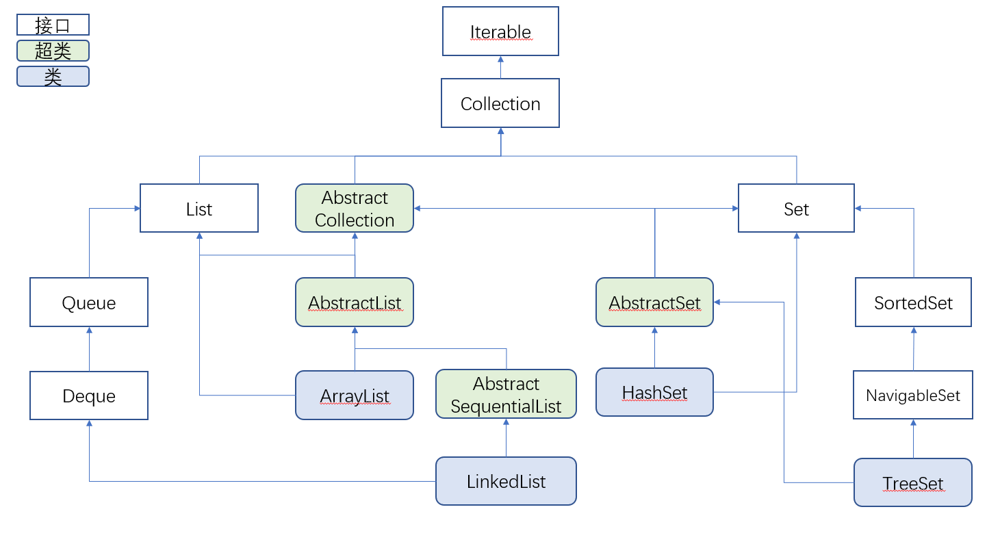
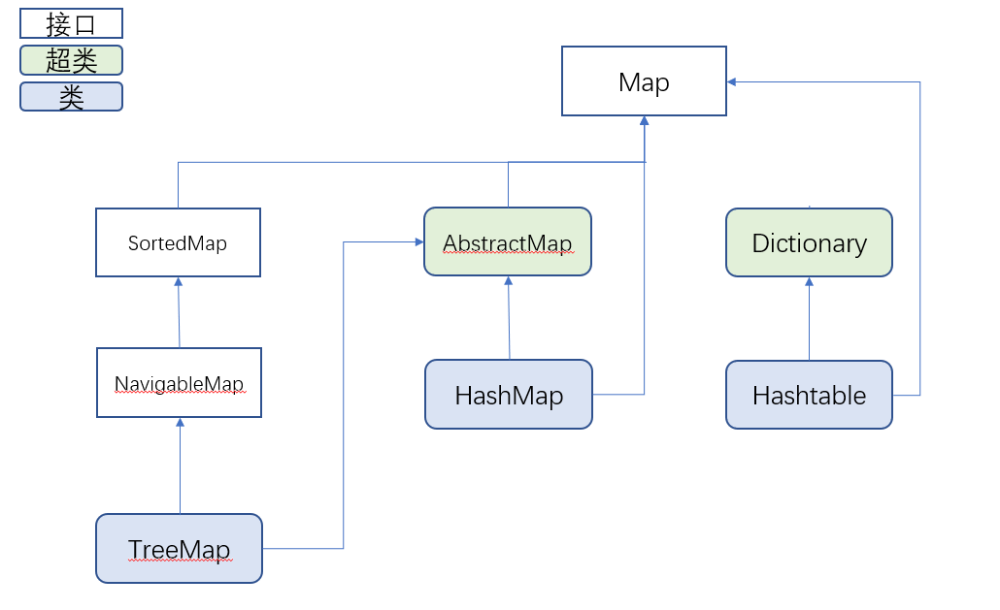

# Java快速入门（从C++到Java）
***

***
## Java容器
和C++一样，Java有着自己的容器。但是Java的容器稍显复杂，我们先来看一下继承树：



没错这里面其实能用的类没有几个，只有ArrayList（相当于C++中的vector），LinkedList（也就是链表啦），HashSet（集合，不能存储重复的元素），TreeSet（红黑树）,HashMap（字典）, TreeMap（红黑树字典）, HashTable(哈希表)。
当然你可以通过向上转换的方式来实现其他的数据结构（或者容器），比如你可以这样写：

```java
Deque<Integer> deque = new LinkedList<Integer>();

Queue<Ineteger> queue = new LinkedList<Integer>();
```

这样你就可以使用队列和栈了。

所有的容器都是继承的Collection，它是所有容器的总接口。它又是继承的Iterable接口，Iterable接口让Collection有迭代功能。

### 容器差异
不同的容器使用方法不一样，比如ArrayList, HashSet和LinkedList使用`add()`方法加入数据，而HashMap则是`put()`方法。
其他差异见API文档咯。

### 容器的特性

* 所有的容器都自带有`toString`方法，你可以直接print它们。

* 所有的容器都是范型编程，你可以指定元素类型：
    ```java
    Collection<Integer> collection = new LinkedList<Integer>();
    ```
    或者不指定类型，这样的话类型默认为`Object`，你也可以理解为任意类型：
    ```java
    LinkedList ll = new LinkedList();
    ll.add((Float) 3.14f);
    ll.add((Integer) 5);
    ll.add((Boolean) false);
    ```

### 迭代器
和STL一样，每个容器都可以有迭代器：
```java
Iterator<Object> it = ll.iterator();
while (it.hasNext()) {
    System.out.println(it.toString());
    it.next();
}
```
容器通过`iterator()`方法返回其迭代器。

迭代器有如下常用的方法：

* hasNext()：用来判断是不是迭代到头了
* next()：跳到下一个元素（迭代器前进一步）
* remove()：删除当前元素
* toString()：输出数据的地址
* getClass()

注意迭代器不能输出当前元素，只能输出其地址（这一点和C++不一样）。